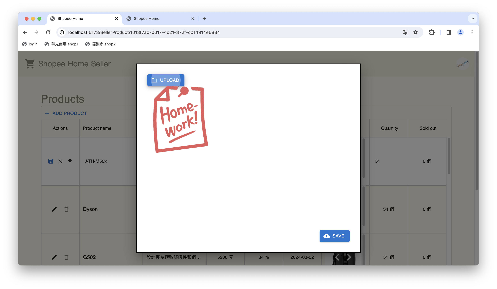

# ShopeeHome-frontend-shop

## Install

 1. 安裝Node.js
 2. 開啟cmd，在ShopeeHome-frontend目錄下輸入npm install
 3. 輸入npm run dev
 4. 把螢幕上出現的網址貼到 disable CORS policy 的 google chrome 瀏覽器 

## How to use
   1. 在未登入的情況下，無法使用任何賣家功能
      

   2. 預設商家有：
      1. 帳號為`shop1@gmail.com`，密碼為`shop1`
      2. 帳號為`shop2@gmail.com`，密碼為`shop2`
   
   3. 登入後會顯示賣家管理頁面(預設是賣家基本資訊頁面)
      
   4. 點擊右側賣家頭像，可以切換以下不同賣家資訊頁面
      - 賣家基本資訊頁面
      - 賣家優惠卷管理頁面
      - 賣家商品管理頁面
      - 賣家訂單管理頁面
      - 登出(回到登入頁面)
      

### 賣家基本資訊頁面
#### 功能
賣家可以在此頁面查看和修改基本資訊，包含：
- 賣家名稱
- 賣家電話
- 賣家電子信箱
- 賣家地址
- 賣家簡介
  
#### 操作方式
按下`鉛筆符號`可以修改使用者的基本資訊，修改完後按下`儲存符號`，即可儲存使用者的基本資訊，或是按下`取消符號`，即可取消修改使用者的基本資訊  
      
        

### 賣家優惠卷管理頁面
#### 功能
賣家可以在此頁面新增和刪除兩種優惠卷，包含：
- Seasoning Coupon
- Shipping Coupon
  
為避免消費糾紛，優惠卷不提供修改功能，只能新增和刪除。優惠卷名稱依據優惠卷種類自動產生，並且不提供編輯功能。

#### 操作方式
按下`ADD COUPON`可以新增優惠卷，按下`垃圾桶符號`可以刪除優惠卷

#### 欄位輸入限制
- Discount rate 和 Discount Limit 皆為數字且不得為空
-  0 < Discount rate < 1
-  0 ≤ Discount Limit
   

### 賣家商品管理頁面
#### 功能
賣家可以在此頁面新增、修改和刪除商品，包含：
- 商品名稱
- 商品描述
- 商品價格
- 商品優惠
- 商品優惠期限
- 商品圖片
- 商品庫存
- 商品銷售量

商品圖需在商品新增後才能上傳，不提供商品圖片編輯功能。商品銷售量為唯讀欄位，不提供編輯功能。

#### 操作方式
按下`ADD PRODUCT`可以新增商品，按下`垃圾桶符號`可以刪除商品，按下`鉛筆符號`可以修改商品資訊，修改完後按下`儲存符號`，即可儲存商品資訊，或是按下`取消符號`，即可取消修改商品資訊。按下`上傳圖片符號`可以上傳商品圖片。

#### 欄位輸入限制
- 商品名稱、商品價格不得為空
- 商品優惠需介於0~1之間，若無輸入則預設為不打折
- 若有商品優惠商品優惠期限不得為空
- 商品庫存預設為0，不得為負數
- 商品圖片只提供上傳圖片的功能，不提供圖片編輯功能。

### 賣家訂單管理頁面
#### 功能
賣家可以在此頁面查看訂單資訊。當商品寄出後，賣家可以在此頁面將訂單進度更新為已寄出。顯示訂單詳細資訊時，提供勾選框，賣家可以在此頁面做訂單檢查。

訂單進度有以下三種裝態：
- 橘色`SHIP`代表訂單尚未寄出
- 藍色`SHIPPING`代表訂單已寄出正在運送中
- 綠色`COMPLETED`代表訂單已完成
  
#### 操作方式
- 按下藍色`DETAILS` 以查看訂單詳細商品資訊
- 按下橘色`SHIP` 來更新訂單進度

